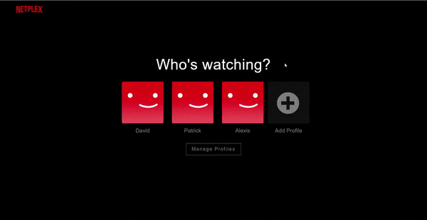

<p align="center">
    
</p>

<p align="center">
    <h1 align="center">Netplex</h1>    
</p>

<p align="center">
    <h2 align="center">A picture-perfect single-page application clone of Netflix.</br></br>
    Start viewing <a href="https://netplex-app.herokuapp.com/#/"><strong>here!</strong></a>
    </h2>   
    
</p>

<p align="center">
    
    
    
    
    
    
    </br>
    
    
    
    
    
    
</p>


<p>
    <h2>Overview</h2>
    Netplex is a clone of Netflix, a video streaming platform, where signed up users can create profiles, watch videos, and add videos to personalized lists. 
</p>

<p>
    <h2>Technologies Used</h2>
    <ul>
        <li><b>Backend</b>: Rails</li>
        <li><b>Frontend</b>: React-Redux</li>
        <li><b>Languages</b>: Ruby, Javascript, CSS, HTML</li>
        <li><b>Storage</b>: AWS S3</li>
        <li><b>Hosting</b>: Heroku</li>
    </ul>
</p>

<p>
    <h2>Features</h2>
    <ul>
        <li><h3>User Authentication</h3></li>
        Users can sign up, login, and logout, secured by a user authentication policy.
        
        </br>
        <li><h3>Manage Profiles</h3></li>
        Users can create and manage up to 5 profiles.
        
        </br>
        <li><h3>Watch Videos</h3></li>
        Users can preview and watch videos sorted by genre.
        
        </br>
        <li><h3>My List</h3></li>
        Users can create a list of videos specific to each profile.
            
    </ul>
</p>

## Featured Code Snippet

Fetching videos from "My List" for specified profile:
````
def show
    profile = Profile.find_by(id: current_profile.id)                      
    @lists = profile.lists.where(profile_id: current_profile.id).ids        
    @lists.map! { |id| Video.find_by(id: List.find_by(id: id).video_id)}    
        
    if @lists
        render :show
    else
        render json: ["No list found"]
    end
end
````

